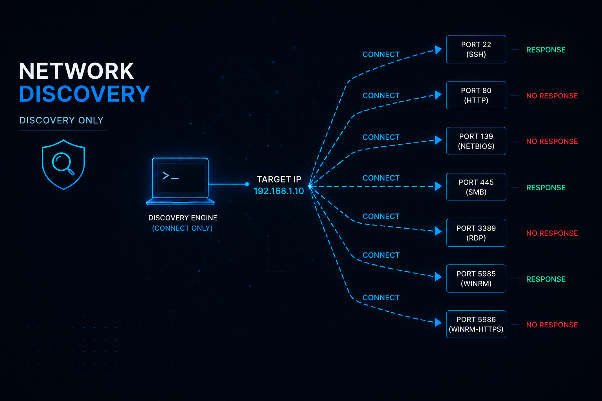

# WAUIG Bank Enterprise Security Discovery Orchestration Framework



## Overview

The WAUIG Bank Enterprise Security Discovery Orchestration Framework is an agentless, non-exploitative Python discovery tool for authorized security discovery and validation.

It is designed to help authorized operators run repeatable discovery from a controlled vantage point and produce structured JSON output and human-readable Markdown reporting.

The framework supports controlled discovery and analysis across network, identity, application/service, telemetry/logging, host-configuration, and correlation capabilities through the approved command-line execution path.

## Authorized Use Only

Use this tool only against systems, networks, and targets where you have explicit authorization.

This tool is intended for controlled security engineering, validation, lab, or approved internal assessment use. It must not be used against unauthorized targets.

Use of this tool assumes:

- Authorized operator activity
- Agentless execution
- No credentials
- No authentication attempts
- Non-exploitative discovery
- No target state modification
- Controlled handling of generated output artifacts

This README does not grant authorization to run the tool and does not imply approval for production deployment.

## Safety Model

The framework is designed for safe, non-exploitative discovery.

For TCP-based checks, the approved interaction model is connect-only:

- A single TCP connection attempt is used to determine reachability
- No payload is sent
- No banner is read
- No protocol negotiation is performed
- No TLS handshake is initiated or inspected
- No authentication is attempted
- No enumeration is performed
- No target data is retrieved
- The connection is terminated after the result is determined

The tool must not be used for exploitation, credential testing, brute force activity, unauthorized enumeration, or disruptive testing.

## Requirements

Before installation, the local environment must have:

- Python 3.10 or newer
- `pip` available through Python
- Python virtual environment support
- Approved project source available locally

The package currently requires no third-party runtime dependencies beyond the Python standard library.

## Environment Readiness Check

Run the platform-appropriate readiness check from the project root before installation.

Linux / POSIX shell:

```bash
bash scripts/check_environment_readiness.sh
```

Windows PowerShell:

```powershell
.\scripts\check_environment_readiness.ps1
```

The readiness check validates local prerequisites only. It does not install Python, repair the operating system, modify system configuration, or remediate missing prerequisites.

If the readiness check fails, stop the installation process. Do not attempt local remediation as part of this workflow. Escalate the failed readiness result through the approved management, administration, or control process for review and remediation direction. Re-run the readiness check only after the environment has been approved for continued installation.

## Installation

Install the tool inside a local Python virtual environment.

The approved installation workflow is:

```text
readiness check
→ create virtual environment
→ activate virtual environment
→ install package with pip inside the active virtual environment
→ validate installed command
→ run authorized discovery
```

### Linux / POSIX Installation

From the project root:

```bash
python3 -m venv .venv
source .venv/bin/activate
python -m pip install .
wauig-discovery --help
```

### Windows PowerShell Installation

From the project root:

```powershell
py -3 -m venv .venv
.\.venv\Scripts\Activate.ps1
python -m pip install .
wauig-discovery --help
```

Use the installed `wauig-discovery` command after installation.

## Basic Usage

Show command help:

```bash
wauig-discovery --help
```

Run an authorized console-only discovery execution:

```bash
wauig-discovery --target <authorized-target> --no-files
```

Run an authorized discovery execution and write output artifacts:

```bash
wauig-discovery --target <authorized-target> --output-dir <output-directory>
```

Run with an explicit run identifier:

```bash
wauig-discovery --target <authorized-target> --output-dir <output-directory> --run-id <run-id>
```

## CLI Options

| Option | Required | Purpose |
| --- | --- | --- |
| `--target` | Yes | Target IP address or hostname for authorized discovery execution |
| `--output-dir` | No | Directory where output artifacts are written; defaults to the current directory |
| `--no-files` | No | Disables file artifact generation and prints results to the console |
| `--run-id` | No | Optional run identifier for traceability |

## Source-Tree Execution

The installed command is the preferred operator path after package installation.

For source-tree validation, the original direct execution path is also supported:

```bash
python3 cli.py --target <authorized-target> --no-files
```

After installation, prefer:

```bash
wauig-discovery --target <authorized-target> --no-files
```

## Output Artifacts

When file output is enabled, the framework writes the following files to the selected output directory:

- `discovery_run.json`
- `discovery_report.md`

`discovery_run.json` contains the structured machine-readable run output.

`discovery_report.md` contains the human-readable Markdown report.

When `--no-files` is used, file artifacts are not written and output is printed to the console.

## Generated Output Handling

Generated discovery outputs are local run artifacts.

Do not commit generated run outputs, virtual environments, packaging build artifacts, caches, or temporary files unless an artifact has been intentionally promoted as approved validation evidence.

Typical local artifacts that should remain out of version control include:

- `.venv/`
- `venv/`
- `build/`
- `dist/`
- `*.egg-info/`
- `__pycache__/`
- generated discovery output files from routine local runs

## What This Tool Does Not Do

This tool does not:

- Authorize discovery against unauthorized targets
- Perform exploitation
- Trigger vulnerabilities
- Harvest credentials
- Use, transmit, test, or validate credentials
- Attempt authentication
- Perform brute force activity
- Perform protocol negotiation
- Read banners
- Parse service responses
- Initiate or inspect TLS handshakes
- Enumerate users, shares, endpoints, directories, tickets, metadata, or services
- Modify target systems
- Install agents on targets
- Run as an API, dashboard, daemon, or service
- Provide production deployment approval

## Operational Notes

Run the tool only from an approved environment and only against authorized targets.

Keep generated outputs protected according to the sensitivity of the assessment target and the operating environment.

Use `--run-id` when a specific execution needs to be correlated with a change request, validation activity, or review record.
